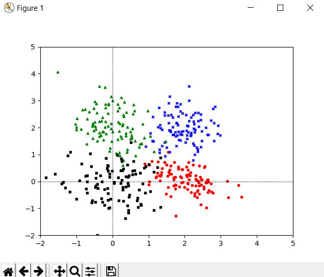
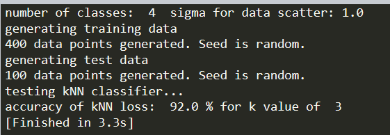
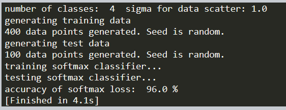
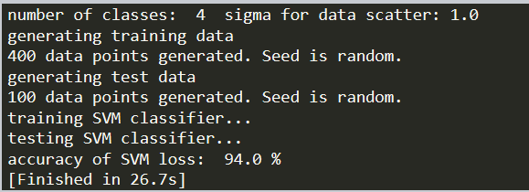

# Introduction
* 主要基于numpy的自己计算实现的knn, softmax, cross-entropy, SVM。  
* 其中SVM和softmax, cross-entropy实现分类是基于minimize函数。  
	* 流程为：计算出loss之后带入minimize，找到能生成最小loss的函数。
	* 使用该函数进行分类。
* 本作业目的只是熟悉使用SVM, softmax和cross-entropy计算loss，所以minimize只是测试工具。

# 运行结果
### input数据分布图  
  
  
### knn  
  
  
### softmax  
  
  
### SVM  
