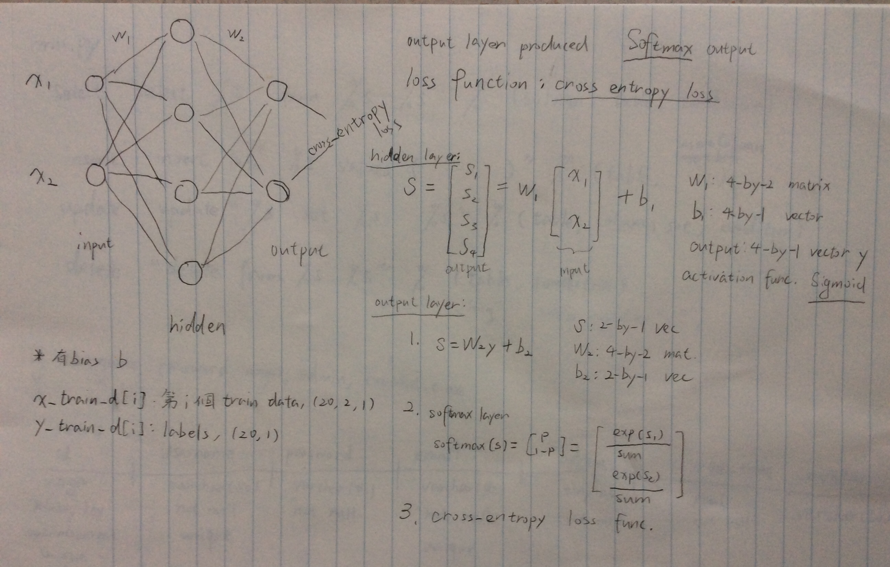
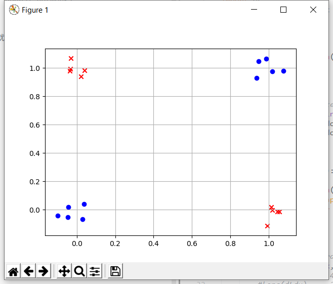
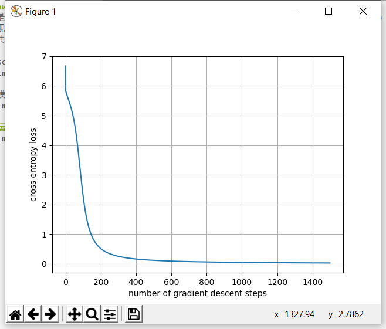
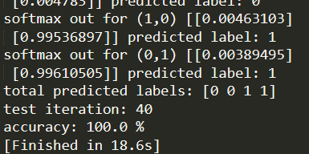

# 📕 hw2 introduction
这是主要基于python的numpy实现的反向传播神经网络(backpropagation neural network)实现的XOR分类，具体内容可查看作业说明PDF和代码文件~  
总共2个classes，20个点(instances)。

* softmax->cross-entropy loss的gradient的推算手稿，既然有草稿就不手打了😂  
  

* 模型的构造
  

* instances的分布  
  

* 随着训练次数而下降的cross-entropy loss  
  

# 📖 运行结果
