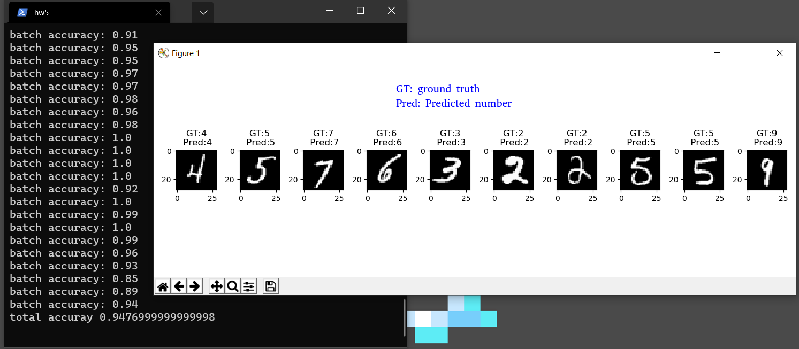

# Introduction
这是本学期第四次编程作业，由卷积神经网络实现的数字图片识别。  
hw3也是数字图片识别，区别在于上一次是完全我作为初学者自己写得神经网络。  
这次是教授给的框架，我只用把**forward**和**backprop**函数和**momentum**算法写好就行了。所以这次的模型速度又快准确率又高。  

## 一些截图  
### CNN architecture  

    
    

  

### Input: 7万张28x28x1像素图片（六万张训练(train)，一万张测试(test)，6万训练集中有一万分出来做验证集(validation)）  

  
    

  

### 运行时: 每**50**次update打印一次loss，每**200**次update打印一次**训练准确度**和**验证准确度**。  
* 训练准确度(training accuracy)指当前模型对接下来一批(batch)输入的准确度，是还未进行训练的批次。  
* 验证准确度(validation accuracy)指当前模型对从训练集以外随机抽取的一批验证数据集的准确度。  

  
    

  

### Output:  
* 上面部分的**batch accuracy**是对测试集预测的准确度，因为是分批次测试，所以每批次测试结束后打印一次当前批次的准确度  
* 所有的测试结束之后会打印**total accuracy**，即模型对测试集的总准确度。  
* 下面的十张图片是随机抽取十张进行测试，上面有label和predict结果，正确则黑色字体，错误则红色字体（图中全对所以都是黑色）：  

  
    

  
  

  
    

  

### 总花费时间（单位：分钟）  

  
    

  