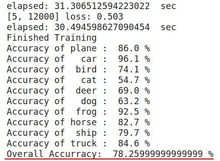

# Introduction
这是本学期深度学习最后一次编程作业，使用pytorch实现CIFAR-10分类。使用残余网络(residual networks)通过保留输入的特征达到即使是很深的layer准确率也不会降低的效果。  
本次模型的architecture是基于"Identity Mappings in Deep Residual Networks"实现  
* link: https://arxiv.org/pdf/1603.05027.pdf  

接下来对本神经网络进行简单的说明，如果想详细了解如每个stage和block的构造可以参考PA1.pdf文件

## Some Screenshots
### Architecture of entry network
* input先经过3x3 conv层，再经过四个stages，最后avg pooling后通过full connection得到结果。  
<div  align="center"><kbd>    
    
</kbd></div><br>  
  
  
* Stage 1 architecture:  
<div  align="center"><kbd>    
    
</kbd></div><br>  
  
  
* Stage 2:  
<div  align="center"><kbd>    
    
</kbd></div><br>  
  
  
* Stage 3 and stage 4:
<div  align="center"><kbd>    
    
</kbd></div><br>  
  

### Running:  
    * 首先检测能否使用GPU加速，如果不能则自动使用CPU，然后打印当前设备。
    * 下载学习资料
    * 每2000个mini-batches输出一次信息，格式如下。内容有花费时间，当前epoch, batch数，loss
        * elapsed: ...  sec  
        [epoch, mini-batches] loss: ...
<div  align="center"><kbd>    
    
</kbd></div><br>  

### Result (每个stage只有2个block时的结果，经实测调整block数可以增加准确度)  
<div  align="center"><kbd>    
    
</kbd></div><br>  
  
## How to modify the number of block  
由于只是作业所以每个stage只有两个block:  
```
# define network
net = IdentityResNet(nblk_stage1=2, nblk_stage2=2,
                     nblk_stage3=2, nblk_stage4=2)
```
如果想调整block数以提高准确度在上方代码中修改数字即可

## 最后说下感想
用pytorch写网络真的比用numpy快而且简单多了，当用30行代码完成之前500行用numpy完成的网络时突然觉得空虚。  
但是不得不承认，用numpy自己写forward和backprop函数的经历让我对整个网络的小到大的理解透彻了很多很多，这在写这个程序的时候体现得很明显：熟悉pytorch语法和写法然后写完这个程序只花了一早上时间。