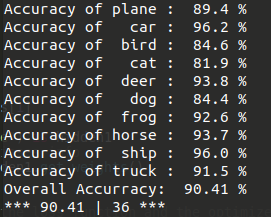

# 📕 Introduction
这是本学期深度学习最后一次编程作业，使用pytorch实现CIFAR-10分类。使用残余网络(residual networks)通过保留输入的特征达到即使是很深的layer准确率也不会降低的效果。  
本次模型的architecture是基于"Identity Mappings in Deep Residual Networks"实现  
* link: https://arxiv.org/pdf/1603.05027.pdf  

接下来对本神经网络进行简单的说明，如果想详细了解如每个stage和block的构造可以参考PA1.pdf文件


## 🤔 How To Run

1. Install the [requirement](https://raw.githubusercontent.com/Lin-CX/deep-learning/main/requirements_dl.txt) packages of this project.
2. `git clone https://github.com/Lin-CX/deep-learning/tree/main/hw5-CIFAR-10`

3. `python3 CIFAR-10.py`


## Some Screenshots

### 🎈 Architecture of entire network
* input先经过3x3 conv层，再经过四个stages，最后avg pooling后通过full connection得到结果。  
<div  align="center"><kbd>    
    
</kbd></div><br>  
  

* Stage 1 architecture:  
<div  align="center"><kbd>    
    
</kbd></div><br>  
  

* Stage 2:  
<div  align="center"><kbd>    
    
</kbd></div><br>  
  

* Stage 3 and stage 4:
<div  align="center"><kbd>    
    
</kbd></div><br>  
  

### 🎈 Running:
* 首先检测能否使用GPU加速，如果不能则自动使用CPU，然后打印当前设备
* 下载学习资料
* 每2000个mini-batches输出一次信息，格式如下。内容有花费时间，当前epoch, batch数，loss
    * elapsed: ...  sec
    [epoch, mini-batches] loss: ...

<div  align="center"><kbd>    
    
</kbd></div><br>  

### 🎈 Result when each stage has only 2 blocks  (the accuracy can be increased by adjusting the number of blocks)  
<div  align="center"><kbd>    
    
</kbd></div><br>  

## 🎈 How to modify the number of block
由于只是作业所以每个stage只有两个block:  
```python
# define network
net = IdentityResNet(nblk_stage1=2, nblk_stage2=2,
                     nblk_stage3=2, nblk_stage4=2)
```
如果想调整block数以提高准确度在上方代码中修改数字即可

* Result of changed the block number of netword and data augmentation as below, accuracy increased 8%


```python
# using RandomHorizontalFlip and RandomCrop function to data augmentation
transform = transforms.Compose([transforms.RandomHorizontalFlip(),
                                transforms.RandomCrop(28),
                                transforms.ToTensor(),
                                transforms.Normalize((0.5, 0.5, 0.5), (0.5, 0.5, 0.5))])

# define network
net = IdentityResNet(nblk_stage1=4, nblk_stage2=5,
                     nblk_stage3=6, nblk_stage4=3)
```



* 本来想要继续调整参数提高准确率，但是电脑太慢了就到此为止吧。

  I wanted continue to adjust the parameters to improve the accuracy, but my computer is so slow. Let's stop here.


## 🎈 最后说下感想
用pytorch写网络真的比用numpy快而且简单多了，当用30行代码完成之前500行用numpy完成的网络时突然觉得空虚。  
但是不得不承认，用numpy自己写forward和backprop函数的经历让我对整个网络的小到大的理解透彻了很多很多，这在写这个程序的时候体现得很明显：熟悉pytorch语法和写法然后写完这个程序只花了一早上时间。